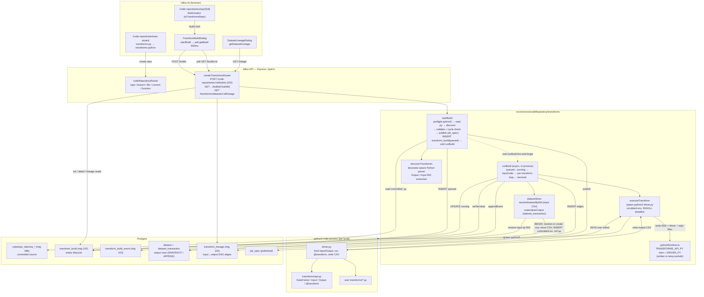

# Transforms — Code Repository Python `@transform` build engine

> Scope: this document covers **Code Repository Python Transforms** — Foundry-style
> `@transform`-decorated Python functions authored inside a Code Repository that read
> Input datasets and write Output datasets. The word "transforms" is overloaded in
> `tellus`; see [Disambiguation](#disambiguation) for the other subsystems that share
> the name and are **not** covered here.

## 1. Overview

A "transform" in this subsystem is a Python function decorated with `@transform`,
`@transform_df`, or `@transform_pandas` from a `transforms.api` package, declaring its
outputs and inputs as dataset RIDs:

```python
from transforms.api import transform, Output, Input

@transform(output=Output("ri.foundry.main.dataset.out"),
           source=Input("ri.foundry.main.dataset.in"))
def my_transform(output, source):
    output.write_dataframe(source.dataframe().filter(lambda r: r["amount"] > 0))
```

The `transforms-python` repository template (`src/services/templates/manifest.ts:438`,
const `TR_PYTHON_1_0_0`) seeds a new repo with example transforms, a CI pipeline, and
branch-protection settings. A **build** discovers the `@transform` decorators in
committed source, runs each transform in a sandboxed `python3` child process against
real dataset CSV files, materializes each output as a committed `dataset_transaction`,
and records input→output lineage edges — persisting the build lifecycle
(`queued → running → succeeded | failed`) in three dedicated tables created by
migration `103_create_transforms.sql`.

The engine is **real, not scaffold** (verified by direct code read): it spawns a real
CPython interpreter, executes the user's row-level logic, and writes real dataset rows
and lineage. Two honest caveats: (1) the `transforms.api` SDK the user imports is a
Tellus-authored **pure-stdlib subset** of Palantir's `transforms-python` (not Spark or
pandas by default — `.pandas()` upgrades when pandas is installed), and (2) the
dispatch model is **in-process fire-and-forget** on the Node.js event loop — there is
no durable queue/worker, no single-active enforcement, and no crash-recovery sweeper.

### Disambiguation

"transforms" appears in six unrelated `tellus` subsystems. Only the first is this
document's subject:

| Subsystem | Runtime / model | File | Same as code-repo Python transforms? |
|---|---|---|---|
| **Code Repository Python transforms** (this doc) | `python3` child process; `@transform` over whole datasets | `src/services/codeRepository/transforms/` | — |
| Pipeline-node declarative transforms | DuckDB SQL or pure-TS; Cast/Filter/Drop/Rename/Join/Union (no user code) | `src/services/transformService.ts`, `src/services/pipelines/duckdbTransformEngine.ts` | No |
| Pipeline UDF transform | gVisor-isolated K8s Job; per-row `transform(row)→row` in python\|js | `src/services/pipelines/udfTransform.ts`, `udfRunner.ts` | No (different runtime **and** I/O model) |
| Indexing row transformer | pure-TS; CSV row → OpenSearch document | `src/services/indexing/rowTransformer.ts` | No |
| Quiver OT `transform` | pure-TS; Operational Transformation for collaborative editing | `src/services/quiver/ot/transform.ts` | No ("transform" = OT rebase, not data) |
| Funnel Stage-2 transform | pure-TS; row → sharded `TransformedObject` (OSv2 capacity contract) | `src/services/funnel/pipeline/stage2-transform.ts` | No |

The pipeline UDF is the most easily conflated with the code-repo transform because both
"run Python." They differ in runtime (gVisor K8s pod vs. `python3` child process), I/O
model (per-row map via env var vs. `@transform` over whole datasets by RID), feature
boundary (Pipeline Builder node vs. Code Repository), and selection gate
(`TELLUS_UDF_RUNTIME=k8s` vs. `TELLUS_PYTHON_BIN` on `PATH`).

## 2. Workflow

End-to-end lifecycle of a transform, from repo creation to observed output.

**1. Create.** The wizard at `tellus-fe/app/code-repositories/new/page.tsx` maps the
`transforms-py` card to template id `transforms-python` (`:83`). `POST /v1/code-repositories`
runs the **create saga** (`src/services/codeRepository/saga/executor.ts`,
`executeCreateRepositorySaga`): a 4-step state machine — Compass reserve → Stemma
create → Template scaffold → activate. Step 3 (`runStep3`, `executor.ts:266`) calls
`template.scaffoldAndPush`, which reads the manifest, substitutes `{{datasetRid}}`, and
commits 5 seed files (`transforms/example.py`, `transforms/enrich.py`,
`transforms/_incremental_example.py`, `ci.yml`, `repoSettings.json`) onto the default
branch via `stemma.commitFiles`.
> **Wiring gap:** the saga passes only `{ packageName }` to `scaffoldAndPush`
> (`executor.ts:281-283`) — it never passes `datasetRid`, so every wizard-created
> transforms repo bakes in the manifest default `ri.foundry.main.dataset.placeholder`.
> The FE strips `datasetRid` from the UI (`new/page.tsx:1127-1132`); the parameter's
> `required:true` is satisfied by the default, so it is inert on this path.

**2. Author & commit.** The user edits `transforms/*.py`, adding `@transform` functions
with real `Output("ri…")` / `Input("ri…")` RIDs, then commits via
`POST /:rid/branches/:branch/commits` (`admin/routes.ts:1186`). The commit is
optimistic-concurrency fenced: `If-Match: <parentSha>` → `stemma.commitFiles({parentSha})`;
`PostgresStemma` does `SELECT head_sha … FOR UPDATE` and returns `stale-ref` on mismatch
(`adapters/postgres.ts:104-118`). The new HEAD is `deterministicSha(...)` over sorted
post-mutation paths, returned as the `ETag` (`routes.ts:1333`).

**3. Trigger.** On the repo detail page (`tellus-fe/app/code-repositories/repo/[rid]/page.tsx`),
a Build button is gated on `isTransformsRepo = repo.templateId.includes("transforms")`
(`:3928`). Clicking opens `TransformBuildDialog`, which calls
`startBuild(rid, branch)` → `POST /v1/code-repositories/:rid/builds`
(`lib/transformsApi.ts:63`). The route (`transforms/routes.ts:42`) calls `startBuild`
and returns **`202`** with `{ buildRid, status: "queued", transforms, branch }`
(`routes.ts:58-63`) — it does **not** wait for the build.

**4. Enqueue + run (async, in-process).** `startBuild` (`buildService.ts:150`):
   - preflights `pythonAvailable()` (spawnSync `python3 --version`), returns
     `Transform:Internal` if absent (`:156-164`);
   - `readRepoPyFiles` reads committed `.py` under `transforms/` or `src/` via the
     Stemma adapter (`listTree` depth 5 + `readBlob`), capturing `commitSha` (`:52-78`);
   - `discoverTransforms(files)` parses the decorators (`:182`);
   - if discovery yields zero transforms or only errors → `Transform:NoTransformsToBuild` /
     `Transform:InvalidTransform` (`:183-194`);
   - builds `job_spec` payloads, `validateJobSpec` + `detectCircularDependencies`
     (`:210-229`);
   - `publishJobSpecs` (idempotent, immutability-fenced; best-effort — a rejection
     surfaces in events but does not abort, `:235-241`);
   - `INSERT INTO transform_build (…, status='queued', …)` (`:245-250`);
   - **`void runBuild(...).catch(...)`** — fire-and-forget; `startBuild` returns
     immediately (`:255-265`). There is no queue, worker thread, or separate process;
     `runBuild` advances on the same event loop.

**5. Execute per transform.** `runBuild` (`buildService.ts:268`):
   - flips `queued → running` guarded `WHERE status='queued'` (single-transition,
     `:276-281`); appends a `started` event;
   - `topoOrder` — Kahn topological sort over output→input edges within the batch, so a
     transform whose `Input` is another transform's `Output` runs after it (`:81-113`);
   - for each transform in order (failure in one is recorded and does **not** abort
     siblings, `:294-296`):
     - `resolveDatasetByRid(inp.rid)` — `SELECT dataset … WHERE rid=$1` + latest
       committed `dataset_transaction.file_path` → the input CSV path
       (`datasetStore.ts:41-67`);
     - `appendEvent(buildRid, "progress", {phase:"executing", transform})`;
     - `executeTransform({transform, files, inputs})` — writes the SDK shim + driver +
       user repo files to a per-build temp workdir, then `spawn(python3, [driverPath])`
       with a scrubbed env (`ENV_WHITELIST`) and a `SIGKILL` deadline; the driver binds
       `Input`/`Output` to real CSV paths, runs the user function, and writes the output
       CSV; result is JSON-over-stdout (`executor.ts:83-222`, `:252-300`);
     - `materializeOutput({rid, csvFilePath, transactionType})` — `scanFile` for schema,
       then a `BEGIN` tx: `SELECT dataset_id … FOR UPDATE`, else `INSERT INTO dataset
       (…, rid, …)`; `moveInto` the CSV under
       `DATA_DIR/datasets/<id>/transactions/<txid>/`; `INSERT INTO dataset_transaction
       (status='committed', …)`; SNAPSHOT supersedes prior committed txns / APPEND adds;
       roll up `dataset` totals (`datasetStore.ts:90-203`);
     - `INSERT INTO transform_lineage (output_dataset_id, input_dataset_id, …)` with
       `ON CONFLICT … DO UPDATE`, self-edges skipped (`buildService.ts:345-355`);
     - `appendEvent("progress", {phase:"materialized", …})`.

**6. Terminal.** `setTerminal` / `setTerminalWithFailures`:
`UPDATE transform_build SET status=…, ended_at=now(), reason=…, outputs=… WHERE rid=$1
AND status IN ('queued','running')` (`buildService.ts:126-144`, `:388-402`) — `rowCount 0`
means already terminal (the terminal-state guard). A `succeeded`/`failed` event is
appended. Partial success is possible: some transforms materialize, others fail, build
status = `failed` with a reason listing both.

**7. Observe.** `TransformBuildDialog` polls `getBuild(rid, buildRid)` every `900ms`
until `isTerminalBuild(status)` (`components/transforms/TransformBuildDialog.tsx:63-71`),
rendering the status Tag, a collapsible build-log of `events`, the materialized output
datasets (`transform`, `rowCount`, `columns`) with links to
`/dataset/<id>?tab=lineage`, and a Rebuild button. `DatasetLineageDialog` (mounted on
the dataset page, `app/dataset/[datasetRid]/page.tsx:869`) calls
`getDatasetLineage(datasetId)` → `GET /v1/transforms/datasets/:datasetId/lineage`
(`lib/transformsApi.ts:109`) and renders the input→output edge graph with per-node row
counts.

**Inputs consumed:** `repositoryRid`, `branch`, `actor` (HTTP body); committed `.py`
source (read via Stemma at the branch HEAD); `Input("ri…")` RIDs resolved to the latest
committed `dataset_transaction` CSV on disk.

**Outputs / side effects:** a `transform_build` row (status lifecycle); `transform_build_event` rows (`started`/`progress`/`log`/`succeeded`/`failed`); `dataset` + `dataset_transaction` rows (the materialized output — indistinguishable from an uploaded dataset, so the existing dataset-preview UI shows it by UUID); `transform_lineage` edges (the input→output DAG); published `job_spec` rows.

## 3. Architecture

The subsystem lives in `src/services/codeRepository/transforms/` and is composed of
seven files with cleanly separated responsibilities:

- **`routes.ts`** — Express `createTransformsRouter`; 4 endpoints, per-route auth via
  `requireCodeReposAuth`. Mounted at `/api/v1` in `server.ts:831` (after the code-repos
  router at `:788`, so `/code-repositories/:rid/builds` falls through to it).
- **`buildService.ts`** — the orchestrator and lifecycle owner. `startBuild` (validate
  + enqueue + return 202) and `runBuild` (async execution loop). Owns the terminal-state
  guard, topological ordering, event append, and lineage writes.
- **`discovery.ts`** — a decorator-aware Python parser. **Not** a real Python AST: a
  line-scanner that balances parentheses to read multi-line `@transform(...)` decorators
  (`scanModule` + `parenBalance`), extracts `Output("…")` / `param=Input("…")` RIDs via
  regex, rejects unsubstituted `{{…}}` placeholders (`looksLikeRid`), and enforces
  one-producer-per-output.
- **`executor.ts`** — the sandboxed `python3` runner. Per-build temp workdir, scrubbed
  env, `SIGKILL` deadline, 8 MiB stdout/stderr cap, JSON-over-stdout result protocol.
  Mirrors the spawn discipline of `services/pipelines/icebergSidecar.ts` and the
  orchestration child-process sandbox.
- **`runtime/pythonRuntime.ts`** — two Python source files emitted as TS string
  constants and written to disk by the executor: `TRANSFORMS_API_PY` (the
  `transforms.api` shim: a pure-stdlib `DataFrame`, `Input`, `Output`, and the
  `transform` / `transform_df` / `transform_pandas` / `incremental` decorators) and
  `DRIVER_PY` (loads the user module via `importlib`, binds I/O to CSV paths, runs the
  function, writes the output CSV). Embedded as strings so they are identical under
  `tsx` and a compiled `dist/` build with no asset-copy step.
- **`datasetStore.ts`** — the RID→dataset bridge. `resolveDatasetByRid` (input lookup)
  and `materializeOutput` (transactional output write). This is the layer that makes a
  transform output indistinguishable from an uploaded dataset.
- **`errors.ts`** — the `Transform:*` error namespace (13 codes), a `status→HTTP` map,
  and a §1.3 envelope builder — separate from the `CodeRepos:*` namespace
  (`codeRepository/errors.ts`).

### Design patterns

- **Pipeline** — the build loop is a fixed sequence
  (`discover → validate → cycle-check → topo-order → execute → materialize → lineage → terminal`).
- **Adapter** — `src/services/codeRepository/adapters/types.ts` defines three
  interfaces: `CompassAdapter` (folder reserve/release), `StemmaAdapter` (the git store:
  `commitFiles`/`listTree`/`readBlob`/…), `TemplateAdapter` (`scaffoldAndPush`). The
  saga depends only on these interfaces. `inMemory.ts` implements all three (test
  double); `postgres.ts` implements **only** `StemmaAdapter` as `PostgresStemma`
  (durable, tables `coderepo_stemma_*`, migration 086). In production
  (`server.ts:775`): Stemma is durable Postgres, **Compass is the in-memory fake**
  (folder reservation is non-durable — a scaffold), and Template is `InMemoryTemplate`
  reading the real B3 manifest and committing through `PostgresStemma`.
- **Saga** — repo **creation** is a 4-step saga with a persisted ledger
  (`saga/ledgerStore.ts`, migration 053) and a pure state machine
  (`saga/stateMachine.ts`). Crucially, **transform builds are not part of the saga** —
  `startBuild` never imports the saga/ledger/stateMachine. Builds are a separate async
  engine triggered by a separate endpoint.
- **Registry** — the template `CATALOG` (`templates/manifest.ts:665`) is a
  `ReadonlyMap<templateId, Map<version, TemplateManifest>>`; accessed by
  `getTemplateManifest(id, version)`.
- **State machine** — the build lifecycle (`queued → running → succeeded | failed |
  cancelled | timeout`) with a terminal-state guard enforced at the app level
  (`setTerminal`'s `WHERE status IN ('queued','running')`).
- **CAS / ETag** — commits are fenced by `parentSha` (`If-Match`); the response
  `ETag` is the new commit SHA.

### Persistence (migration `103_create_transforms.sql`)

- `ALTER TABLE dataset ADD COLUMN rid TEXT` + partial-unique index `dataset_rid_uq`
  (`WHERE rid IS NOT NULL`) — the RID bridge: at most one dataset row per RID, legacy
  uploads keep `NULL`.
- `transform_build` — PK `rid`, `status` CHECK enum, `outputs JSONB`, timestamps;
  indexes on `(repository_rid, branch, enqueued_at DESC)` and a partial
  `transform_build_active_idx` on `(repository_rid, branch) WHERE status IN
  ('queued','running')`. **Note:** `active_idx` is a plain (non-unique) index whose
  comment claims "single-active enforcement" but does not DB-enforce it, and is never
  queried in TS — `startBuild` inserts a new `queued` row without checking for an
  existing active build, so concurrent builds on the same repo+branch are not prevented.
- `transform_build_event` — FK `build_rid → transform_build(rid) ON DELETE CASCADE`,
  `kind` CHECK enum.
- `transform_lineage` — FKs to `dataset(dataset_id)`, PK
  `(output_dataset_id, input_dataset_id, branch)`, a `not-self` CHECK.

### Frontend integration (`tellus-fe`)

Two separate API clients, deliberately split:
- `lib/codeRepositoriesApi.ts` — repo/branch/file/draft/resource-import/function/tag
  (no build/lineage endpoints).
- `lib/transformsApi.ts` — `startBuild`, `listBuilds`, `getBuild`, `getDatasetLineage`
  (the build-engine client; `listBuilds` is exported but has **no FE call site** — there
  is no build-history list view).

UI: `TransformBuildDialog` (trigger + 900ms poll loop + outputs/events/lineage links)
and `DatasetLineageDialog` (lineage graph, mounted on the dataset page). The Build
button appears only when `templateId.includes("transforms")`. The new-repo wizard maps
the card and redirects to the repo detail page via `router.replace(repoDetailPath(rid))`
on success.

## 4. Diagram



## 5. Key files referenced

- `src/services/codeRepository/transforms/routes.ts` — Express router; 4 endpoints (start/list/detail builds + dataset lineage); mounted at `/api/v1` (`server.ts:831`).
- `src/services/codeRepository/transforms/buildService.ts` — `startBuild` (enqueue + 202) and `runBuild` (async loop: topo order → execute → materialize → lineage → terminal); owns the terminal-state guard.
- `src/services/codeRepository/transforms/discovery.ts` — `discoverTransforms`; decorator-aware Python line-scanner (paren-balanced), extracts `Output`/`Input` RIDs, rejects placeholders, one-producer-per-output.
- `src/services/codeRepository/transforms/executor.ts` — `executeTransform`; sandboxed `python3` child process, scrubbed env, SIGKILL deadline, 8 MiB cap, JSON-over-stdout.
- `src/services/codeRepository/transforms/runtime/pythonRuntime.ts` — `TRANSFORMS_API_PY` (stdlib `transforms.api` shim) + `DRIVER_PY` (loads user module, binds I/O, writes output CSV); emitted to the temp workdir.
- `src/services/codeRepository/transforms/datasetStore.ts` — `resolveDatasetByRid` (input CSV lookup) + `materializeOutput` (transactional `dataset`/`dataset_transaction` write, SNAPSHOT/APPEND).
- `src/services/codeRepository/transforms/errors.ts` — `Transform:*` error namespace + §1.3 envelope builder.
- `src/migrations/103_create_transforms.sql` — `transform_build`, `transform_build_event`, `transform_lineage` tables + the `dataset.rid` bridge.
- `src/services/templates/manifest.ts` — `TR_PYTHON_1_0_0` (`transforms-python` template: `datasetRid` param + 5 seed files); `CATALOG` registry.
- `src/services/codeRepository/adapters/types.ts` — `CompassAdapter` / `StemmaAdapter` / `TemplateAdapter` interfaces.
- `src/services/codeRepository/adapters/postgres.ts` — `PostgresStemma` (durable `StemmaAdapter`; CAS-fenced `commitFiles`).
- `src/services/codeRepository/saga/executor.ts` — `executeCreateRepositorySaga` (4-step create saga); step 3 scaffolds the template (passes only `packageName`, not `datasetRid`).
- `src/server.ts` — mount sites: code-repos router `:788` (`PostgresStemma` `:775`); transforms router `:831` (a **second** `PostgresStemma` instance — stateless over the same pool).
- `tellus-fe/lib/transformsApi.ts` — `startBuild` / `listBuilds` / `getBuild` / `getDatasetLineage` (build-engine client).
- `tellus-fe/components/transforms/TransformBuildDialog.tsx` — triggers + polls a build; renders status/events/outputs/lineage links.
- `tellus-fe/components/transforms/DatasetLineageDialog.tsx` — renders the input→output lineage graph.
- `tellus-fe/app/code-repositories/repo/[rid]/page.tsx` — repo detail page; `isTransformsRepo` gates the Build button.
- `tellus-fe/app/code-repositories/new/page.tsx` — wizard; maps the `transforms-python` template, strips `datasetRid`, redirects to the detail page post-create.
